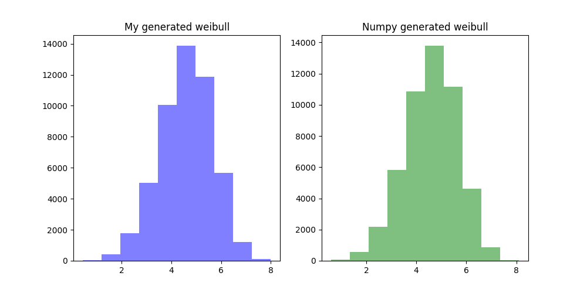

# Random Variate Generator:
A python class library which generates both discrete and continuous random variates

## Requirements
- `Python` 3.6 or above.
- `Dependencies` : Install the python dependencies in requirements.txt.
- `Constants` : Defaults for size of distribution can be changed in rvgen.py, along with various parameters such as Lambda, Mu, Shape, etc.

## Executing
- The entry point is the file "getrv.py", which can be launched simply with the command:  "python getrv.py"
- This will bring up a text-based menu allowing the user to simply type "all" to generate all distributions. Alternatively, the user can type the name of any particular distribution on the menu, e.g. "geometric".  After the distributions are generated, the user is returned to the menu.  When finished, type "exit".

## Output
- Each distribution creates a side-by-side plot comparing:
    - (Blue) The distribution generated from this code and based on the uniform distribution
    - (Green) Numpy generated distribution, using the pre-built numpy generators, with the same parameters as the from-scratch version.
- Plots are saved in the same directory as the launching code, under the naming format, e.g. "dist_weibull.png"

.

## Future Improvements
- Update the input menu to allow a number instead of typed name, for easier input.
- Allow parameter setting from the input menu, e.g. lambda value.

## Author
- Dan Hislop, for a class project with Georgia Tech's ISYE6644 Simulation class as part of MS Analytics program.
